<p align="center">
  
</p>

<h1 align="center">Stone+</h1>

<p align="center"><strong>把多个 AI 账号、API 与编程客户端，收进一个本地智能网关</strong></p>

<p align="center">
  <a href="README.en.md">English</a> · <strong>简体中文</strong>
</p>

<p align="center">
  <a href="https://github.com/M4rkzzz/stone-plus/releases/latest"></a>
  <a href="https://github.com/M4rkzzz/stone-plus/actions/workflows/release.yml"></a>
  <a href="https://github.com/M4rkzzz/stone-plus/releases/latest"></a>
  <a href="LICENSE"></a>
  <a href="https://github.com/M4rkzzz/stone-plus/stargazers"></a>
</p>

<p align="center">
  <strong>本地优先 · 多账号智能调度 · OpenAI / Anthropic / Gemini 协议转换 · OAuth / CPA 批量管理</strong>
</p>

<p align="center">
  <a href="https://github.com/M4rkzzz/stone-plus/releases/latest"><strong>下载最新版</strong></a> ·
  <a href="#三分钟开始使用">三分钟上手</a> ·
  <a href="#核心亮点">核心亮点</a> ·
  <a href="#技术原理">技术原理</a> ·
  <a href="#界面预览">界面预览</a>
</p>

<p align="center">
  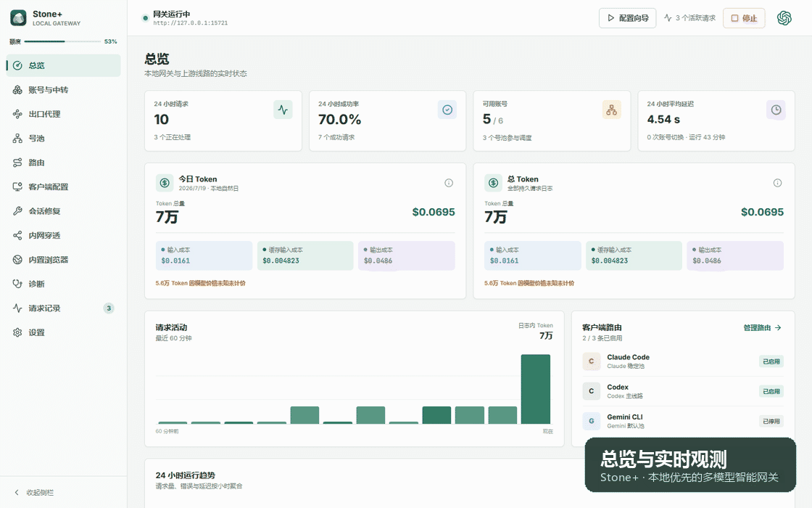
</p>

## Stone+ 是什么？

Stone+ 是 [Stone](https://github.com/EasyCode-Obsidian/Stone) 的社区功能增强版。它运行在你的电脑上，在 **Codex、Claude Code、Gemini CLI** 与多个上游账号/API 之间充当一个本地控制平面：

- 客户端只连接 `http://127.0.0.1:15721`；
- Stone+ 按模型、额度、健康、并发、会话粘性与历史表现选择账号；
- 上游失败、冷却或额度耗尽时，按规则切换到其他可用来源；
- OpenAI Responses、Chat Completions、Anthropic Messages 与 Gemini 请求可以互相转换；
- 凭据、路由、统计和客户端配置全部保存在本机。

> 如果你有多个 Codex/ChatGPT 订阅、官方 API、兼容中转站，或者同时使用多种编程客户端，Stone+ 可以把分散的配置变成一个可观察、可调度、可恢复的本地入口。

## 为什么值得用？

| 你遇到的问题 | Stone+ 的处理方式 |
| --- | --- |
| 多个账号需要反复切换 | 号池自动调度，冷却、额度耗尽和故障账号会暂时退出候选 |
| 同时开多个对话容易挤在一个账号 | 会话粘性保证上下文稳定，多活跃对话会软分流到不同健康账号 |
| 客户端协议与上游协议不一致 | 在 OpenAI、Anthropic、Gemini 协议间转换普通请求、流式事件、工具调用和用量 |
| 导入大量 CPA / Sub2API JSON 很繁琐 | 批量导入、Tag、出口代理、状态刷新、额度探测和模型查询一步完成 |
| 不知道慢在本地、代理还是上游 | 一键检查 DNS、TLS、ChatGPT、Codex、OAuth、系统代理、账号、号池和路由 |
| 改坏 Codex / Claude / Gemini 配置 | 修改前预览并自动备份，可按 Profile 管理和恢复 |
| 希望数据留在自己电脑 | SQLite + 操作系统安全存储，无远程控制服务，不记录请求/响应正文 |

## 界面预览

### 总览：一眼看清网关、账号与请求

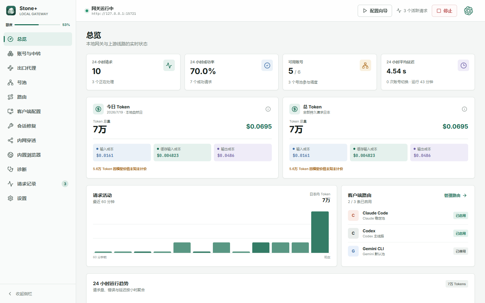

| 账号、额度与历史体质 | 号池、模型与调度策略 |
| --- | --- |
| 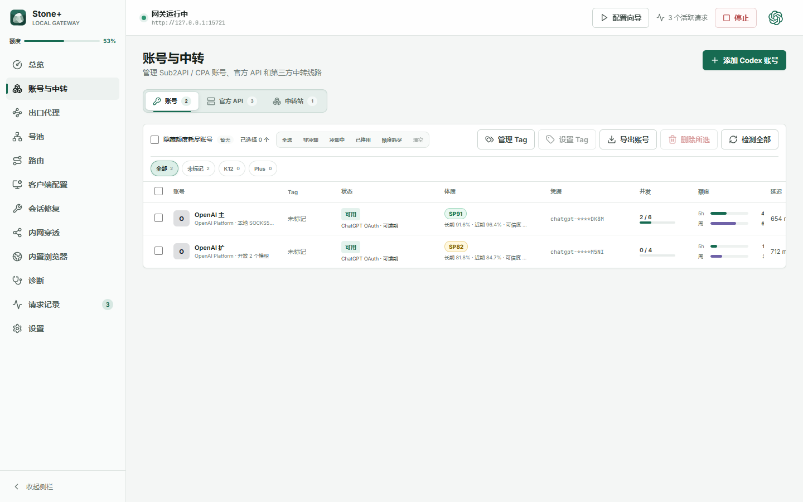 | 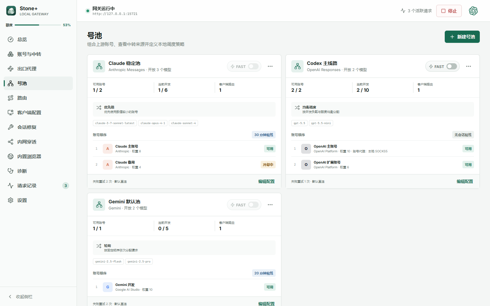 |
| 新手向导与 OAuth | 多客户端路由 |
| 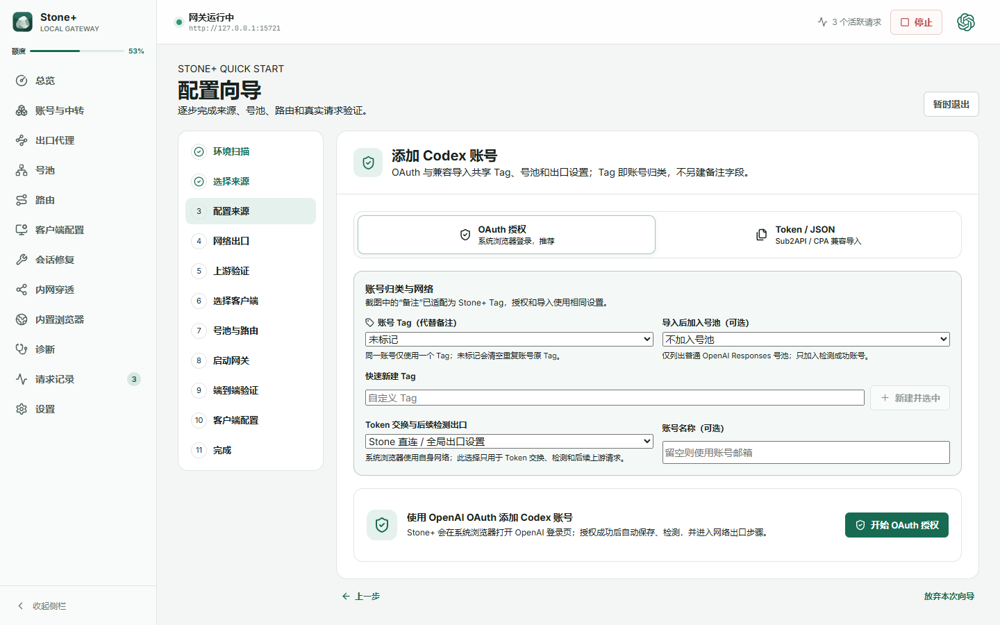 | 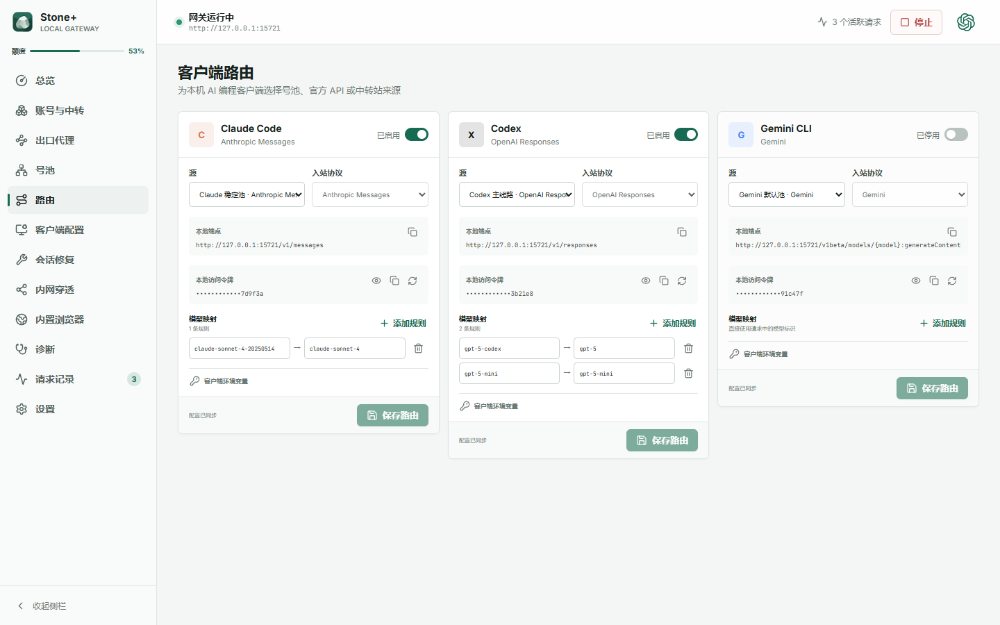 |
| 内置浏览器与 JSON 队列 | 一键网络诊断 |
| 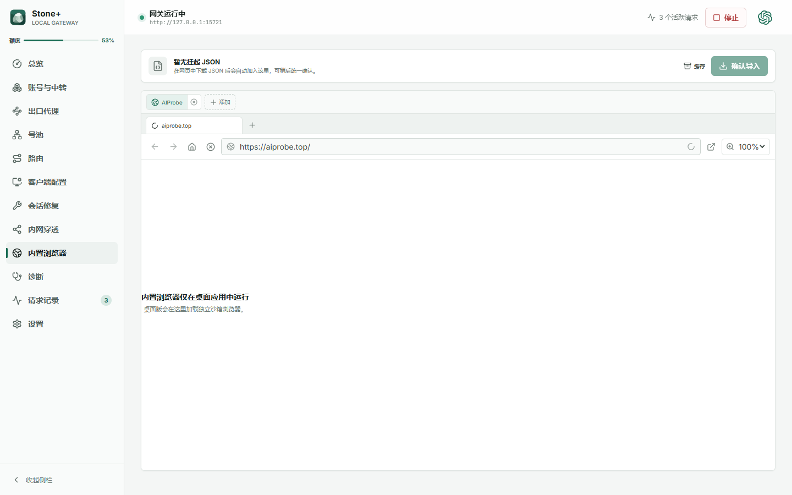 | 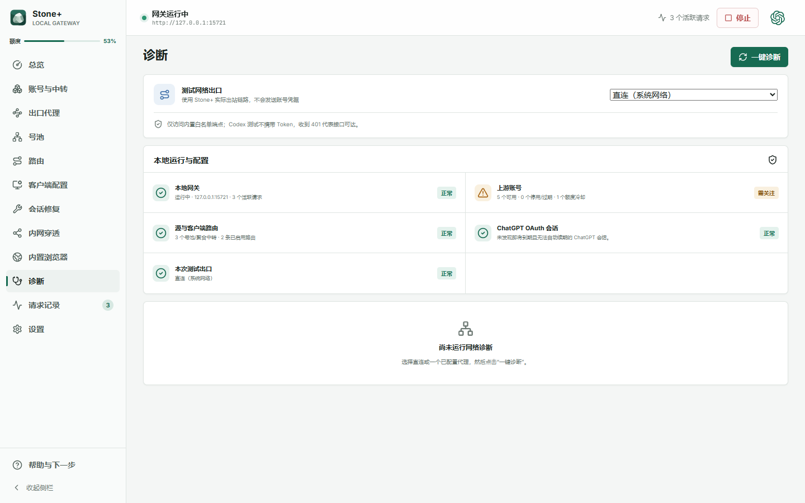 |

<details>
<summary><strong>查看应用内更新弹窗</strong></summary>

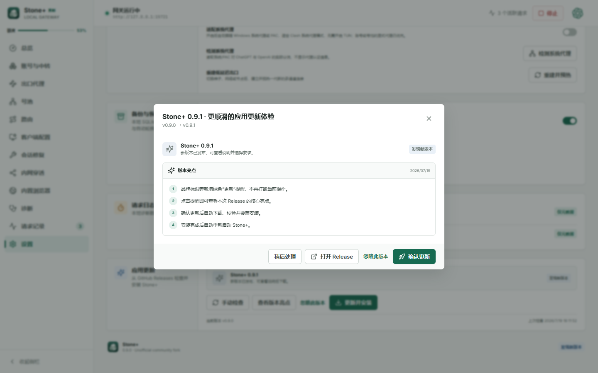

</details>

## 核心亮点

### 1. 新手向导：从“有账号”到“真实请求跑通”

向导不是只保存几项配置，而是按真实链路逐步验收：

```text
环境扫描 → 选择来源 → 配置来源 → 网络出口 → 上游真实测试
        → 选择客户端 → 创建号池/路由 → 启动网关
        → 本地端到端验证 → 预览并应用客户端配置
```

- 支持 **OpenAI OAuth PKCE**、Token/JSON、官方 API、中转站、已有账号和聚合中转；
- OAuth 可设置账号名称、Tag、目标号池与 Token 交换/后续请求的出口代理；
- 自动刷新状态、查询模型，再发送一个极小的真实请求确认权限；
- 放弃本次向导后会清除进度，下次从环境扫描重新开始；
- 最后从本地网关再请求一次，确保鉴权、路由、调度、协议和上游全部可用。

### 2. 智能均衡：不只看“现在谁最快”

`autobalanced` 先执行硬性过滤，再做软评分：

1. **硬过滤**：账号是否启用、模型是否开放、是否冷却、额度是否耗尽、熔断状态、并发槽位；
2. **会话粘性**：同一对话尽量留在原账号，避免上下文和缓存频繁迁移；
3. **并发软分流**：多个活跃对话优先分散到多个健康账号，而不是全部粘住同一个号；
4. **历史移动评价**：综合长期成功率、EWMA 首字、输出速度、稳定性、失败惩罚与实际有效并发；
5. **受控探索**：保留小幅探索机会，避免一个账号因为短期抖动永久失去流量。

账号列表用 `SP86` 这样的 **SP 体质分**展示长期表现；分数采用移动评价，不会因为当前可用账号较少就把其中最好者简单标成 100。

### 3. 账号、CPA 与 Sub2API 批量工作流

- 支持 OAuth、Access Token、单个 JSON、JSON 数组、逐行 JSON 和多文件导入；
- 自动从 JWT 补全缺失的 CPA `account_id`；
- 导入时显示“解析/导入 + 状态刷新 + 模型查询”的总体进度；
- 可批量设置 K12、Plus 或自定义 Tag，并把检测成功的账号追加到指定号池；
- 可保留文件代理、强制直连，或给整批账号统一选择 HTTP/SOCKS 出口；
- 列表显示额度恢复倒计时、5 小时/周额度、实时占槽、延迟和 SP 分；
- 删除账号时自动从相关号池移除并协调模型白名单。

### 4. 多来源路由与聚合中转

一个路由可以直接指向：

- 普通账号号池；
- 多成员聚合中转；
- 官方 OpenAI / Anthropic / Google API；
- OpenAI/Anthropic 兼容中转站。

聚合中转支持故障转移、按请求轮询、按会话轮询和平滑加权轮询。普通号池、聚合中转和中转站都可以在卡片上开启 **FAST**，为兼容的 OpenAI 请求使用 priority service tier。

### 5. 低延迟流式数据面

Stone+ 针对长连接与流式输出做了专门优化：

- HTTP/2 协商、连接复用、keepalive、预热主通道与按负载扩展的备用通道；
- 收到上游流后尽早发送 SSE 响应头和首个可见片段；
- 首正文超时可以切换其他账号，减少“连接成功但一直没字”的等待；
- OAuth 刷新使用 singleflight，同一账号的并发请求不会重复刷新 Token；
- SQLite 请求日志采用批量/合并写入，瞬时并发占槽不写入数据库；
- 可选低延迟竞速请求默认关闭，需要时再显式启用。

### 6. 内置浏览器：下载完再一次导入

- 多标签页、前进/后退、地址栏、缩放和自定义快捷入口；
- 默认快捷入口为 `https://aiprobe.top/`；
- 下载的 JSON 自动进入挂起队列，不必每下载一个就立即处理；
- 全部下载后可批量导入并统一选择出口代理；
- 下载文件同时保留在缓存列表，可再次“另存为”，避免 JSON 丢失。

### 7. 诊断、更新与桌面整合

- 一键诊断 ChatGPT、Codex、OAuth、DNS、TLS、系统代理、上游账号、号池和路由；
- 设置中可明确开启“适配系统代理”，适配 PAC、Clash 等本机代理环境；
- 检测到新版本时在品牌区显示绿色“更新”，点击查看 Release 亮点；
- Windows 安装版与 Linux AppImage 确认后自动下载、校验、覆盖安装并重启；
- 单实例运行：重复打开时聚焦已有主窗口；
- 顶栏 ChatGPT 按钮可安全修复 Codex 会话索引并重新启动 ChatGPT；
- Windows 提供内置 FRP 管理；非 Windows 平台不显示该入口。

## 技术原理

### 请求路径

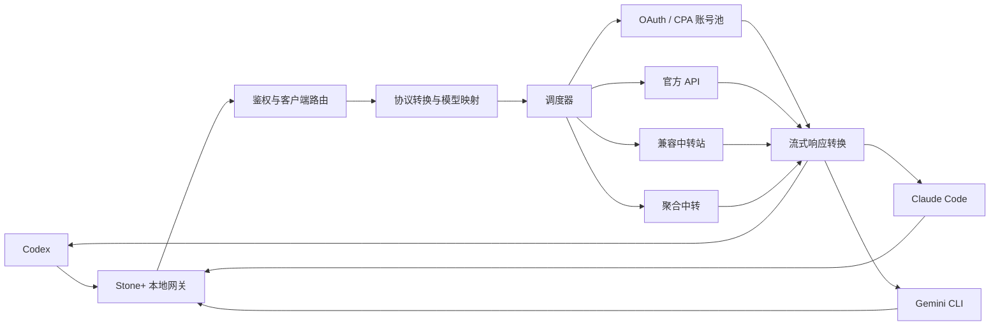

### 调度决策

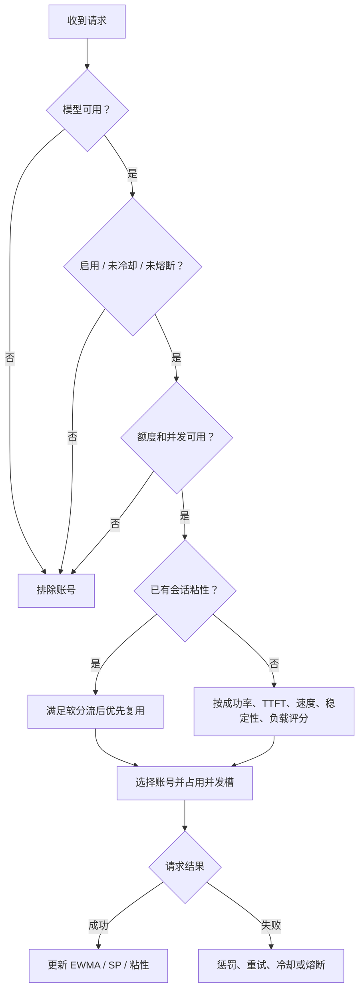

### 协议与客户端

| 客户端/入口 | 入站协议 | 可连接的上游 |
| --- | --- | --- |
| Codex | OpenAI Responses | OpenAI/OAuth、兼容中转、Anthropic、Gemini（经转换） |
| Claude Code | Anthropic Messages | Anthropic、兼容中转、OpenAI、Gemini（经转换） |
| Gemini CLI | Gemini generateContent | Gemini、OpenAI、Anthropic（经转换） |
| 通用 OpenAI 客户端 | Responses / Chat Completions | 账号池、官方 API、兼容中转与聚合中转 |

协议层覆盖普通与流式文本、工具调用、停止原因和 Token 用量。不同厂商能力并不完全对等，Stone+ 会保留能可靠转换的字段，并在不支持时返回明确错误。

### 本地数据与安全边界

| 数据 | 保存位置与处理方式 |
| --- | --- |
| API Key、OAuth Token、代理密码 | Electron `safeStorage`，由 Windows DPAPI、macOS Keychain 或 Linux Secret Service 保护 |
| 账号、号池、路由、统计 | 本地 SQLite 状态库 |
| 请求日志 | 保存状态、耗时、Token 与调度信息；不保存请求/响应正文 |
| 客户端配置 | 写入前生成备份，可预览、恢复，并支持多个 Profile |
| 诊断导出 | 输出经过脱敏的状态和错误摘要，不导出真实凭据 |

Stone+ 默认只监听回环地址，不提供云端控制台、公共账号服务或远程凭据托管。

## 三分钟开始使用

### 1. 下载

从 [GitHub Releases](https://github.com/M4rkzzz/stone-plus/releases/latest) 下载对应平台文件，并可使用 `SHA256SUMS` 校验：

| 平台 | 推荐文件 |
| --- | --- |
| Windows x64 | `StonePlus-*-windows-x64-setup.exe`；免安装可选 portable |
| macOS Intel | `StonePlus-*-macos-x64.dmg` 或 `.zip` |
| macOS Apple Silicon | `StonePlus-*-macos-arm64.dmg` 或 `.zip` |
| Linux x64 | `StonePlus-*-linux-x86_64.AppImage` 或 `StonePlus-*-linux-amd64.deb` |
| Linux arm64 | `StonePlus-*-linux-arm64.AppImage` 或 `.deb` |

Windows 当前未进行代码签名；macOS 为 ad-hoc 签名且未经过 Apple 公证。首次启动前可先核对 Release 中的 SHA-256。

Linux AppImage：

```bash
chmod +x StonePlus-*-linux-*.AppImage
./StonePlus-*-linux-*.AppImage
```

Linux deb：

```bash
sudo apt install ./StonePlus-*-linux-*.deb
```

### 2. 跟着向导走

1. 点击顶部 **配置向导**；
2. 选择 OAuth、Token/JSON、官方 API、中转站或已有来源；
3. 选择直连或出口代理，完成网络和真实上游测试；
4. 选择 Codex、Claude Code 或 Gemini CLI；
5. 让向导创建号池与路由并启动本地网关；
6. 运行端到端验证，预览后应用客户端配置。

之后客户端只需要连接 Stone+。如果已经有完整配置，也可以跳过向导，直接在“账号与中转 → 号池 → 路由 → 客户端配置”中精细调整。

## 功能地图

| 模块 | 主要能力 |
| --- | --- |
| 总览 | 请求量、成功率、账号可用性、平均延迟、Token 与成本、输出速度趋势 |
| 账号与中转 | OAuth/JSON 导入、官方 API、中转站、Tag、额度、SP、批量操作、模型发现 |
| 出口代理 | HTTP、HTTPS、SOCKS4、SOCKS5，连通测试、公网出口与系统代理适配 |
| 号池 | priority、balanced、autobalanced、round-robin、weighted-random、粘性、重试、FAST |
| 路由 | Codex、Claude Code、Gemini CLI，多源选择、模型映射、本地 Token |
| 客户端配置 | Profile、扫描、预览、备份、恢复、结构化编辑 |
| 会话修复 | 扫描 Codex 历史、预览差异、备份 rollout/SQLite、事务修复 |
| 内置浏览器 | 多标签、缩放、快捷入口、JSON 队列、缓存另存、批量代理选择 |
| 诊断 | 网络、OAuth、系统代理、账号、号池、路由与本地网关的分阶段诊断 |
| 请求记录 | 首字、总耗时、Token、模型、账号、路由结果与详细阶段时间 |
| 设置 | 网关、系统代理、自启动、更新、备份与诊断导出 |

## 相比原版 Stone 的主要增强

Stone+ 保留上游 Stone 的本地网关、协议转换、号池、路由和客户端配置基础，并重点扩展：

- 高并发流式性能、连接预热和首正文故障切换；
- 历史 SP 体质分、自适应并发、额度解冻探测和智能均衡；
- CPA/Sub2API 批量导入、Tag、代理、模型查询和安全导出；
- OpenAI OAuth PKCE 与完整新手向导；
- 官方 API、兼容中转、聚合中转和统一多来源路由；
- 内置浏览器 JSON 队列与缓存；
- 网络诊断、Codex 会话修复、Windows FRP、单实例与应用内更新；
- 更完整的请求观测、Token 成本和客户端配置管理。

完整逐版本变化见 [CHANGELOG.md](CHANGELOG.md)，与上游的差异及许可证说明见 [MODIFICATIONS.md](MODIFICATIONS.md)。

## 从源码运行

需要 Node.js 24：

```bash
git clone https://github.com/M4rkzzz/stone-plus.git
cd stone-plus
npm ci
npm run dev
```

质量检查与构建：

```bash
npm run check
npm run dist
```

架构说明见 [docs/ARCHITECTURE.md](docs/ARCHITECTURE.md)。

## 使用边界

- 仅导入你本人拥有或已获授权使用的账号、Token 与 API Key；
- 模型测试和向导验证会发送真实的小请求，可能消耗额度或产生上游费用；
- OAuth/订阅账号能否使用某个模型，最终由上游权限决定；
- Stone+ 不扫描浏览器 Cookie，也不会未经确认自动读取其他应用的凭据；
- 当前产品定位是个人本地桌面网关，不是账号共享、转售、团队计费或公共代理平台。
